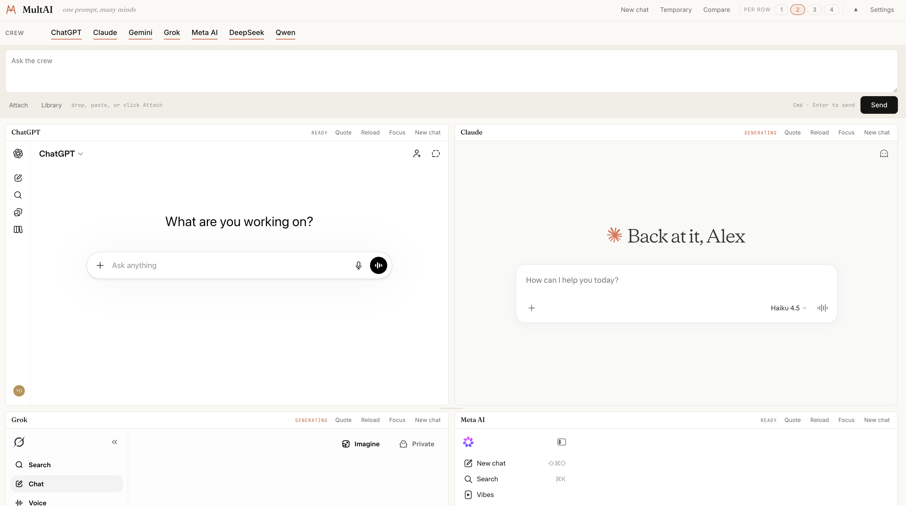
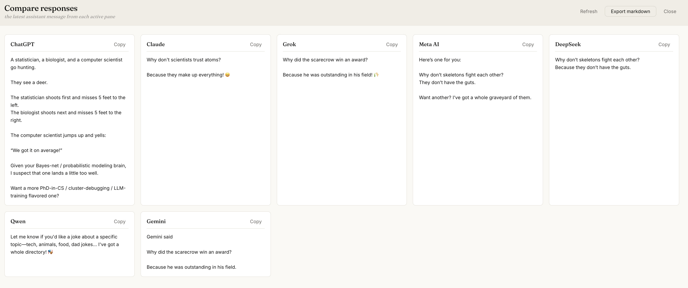
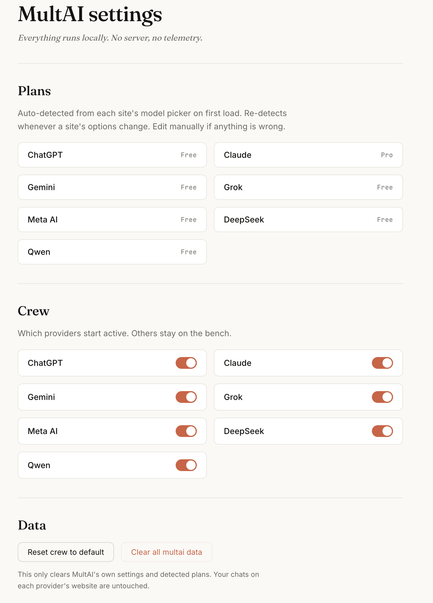

# MultAI

一个提示词，多个模型同时回答。MultAI 是一个 Chrome 扩展，可以在同一个驾驶舱页面内同时与七个 AI 聊天网站对话：ChatGPT、Claude、Gemini、Grok、Meta AI、DeepSeek 和 Qwen。

[English README](./README.md)

## 它做什么

- 一个输入框，把同一个提示词同时广播到所有启用的面板。
- 每个面板就是该提供商的真实网页，通过 iframe 嵌入在驾驶舱里 —— 使用你自己的账号、自己的模型、自己已有的对话历史。MultAI 不会通过任何自建服务器中转内容。
- 并排对比的布局让你一眼就能看出哪个模型在胡说、哪个最快、哪个更理解你在意的细节。

## 功能

- **同时发送** — 输入一次，Cmd + Enter 一键广播给所有启用的面板。
- **附件** — 拖拽、粘贴或点击 Attach 添加文件，MultAI 会把它们转发给每一个支持附件的面板。
- **一键新对话** — 顶部的 New chat 按钮会在每一个启用的面板里重置对话。
- **临时 / 隐身对话** — 单独的按钮会在支持该模式的面板里启动临时会话（目前为 ChatGPT、Claude、Qwen）。
- **Compare 对比面板** — 一个抽屉式窗口，收集每个面板最近一次的助手回复，让你并排阅读，也能一键导出 Markdown。

- **平铺布局** — 可选每行 1 / 2 / 3 / 4 个面板，拖动面板标题可交换位置，拖动两行之间的横向手柄可调整行高。添加或移除一个面板**不会**清空该面板的对话 —— iframe 始终挂载，所以你在每个站点里的历史记录都被保留下来。
- **Bench 候补区** — 当前未启用的提供商会出现在右侧的小面板里，点击即可把它们重新激活。
- **提示词库** — 本地保存并复用常用提示词。
- **可折叠顶栏** — 不需要改动 Crew 时可以折叠整个控制区，让面板占据更大的屏幕空间。

## 隐私

- 一切都在你的浏览器里本地运行。我们没有任何服务器看到你的提示词或回复。
- 每个面板就是该提供商自己的网站，用你自己的登录态加载。你的聊天记录仍然由各家提供商在自己的服务器上保存，和你在普通标签页里打开他们的网站时完全一样。
- 本地存储仅限 `chrome.storage.local`：Crew 选择、面板行高、每行最大面板数、提示词库，以及设置页上展示的订阅计划。

## 安装（未打包模式）

1. 克隆或下载本仓库。
2. 在 Chrome（或任意 Chromium 内核浏览器，如 Edge、Brave、Arc）打开 `chrome://extensions`。
3. 在右上角打开 **开发者模式**。
4. 点击 **加载已解压的扩展程序**，选中本项目根目录（包含 `manifest.json` 的那一层）。
5. 点击工具栏上的 MultAI 图标打开驾驶舱。

第一次打开驾驶舱时，每个面板都需要你在它自己的 iframe 里完成登录。登录之后，浏览器会在后续的访问中自动沿用该会话。

## 使用技巧

- **Cmd / Ctrl + Enter** — 把提示词发送到所有启用的面板。
- **Cmd / Ctrl + /** — 打开提示词库。
- **Cmd / Ctrl + Shift + C** — 打开 Compare 对比抽屉。
- **Alt + 1…9** — 聚焦第 n 个面板。
- **拖动面板标题** 到另一个面板上可以互换它们的位置。
- **拖动两行之间的手柄** 可以调整上下两行的高度。
- **点击某个面板的 Focus 按钮** 可以只保留这一个面板，再点击 Bench 里的其它提供商把别的面板补回来。

## 支持的提供商

| 提供商 | 常规对话 | 临时对话 |
| --- | --- | --- |
| ChatGPT | 支持 | 支持 |
| Claude | 支持 | 支持 |
| Gemini | 支持 | 暂不支持 |
| Grok | 支持 | 暂不支持 |
| Meta AI | 支持 | 暂不支持 |
| DeepSeek | 支持 | 暂不支持 |
| Qwen | 支持 | 支持 |

## 技术说明

- Chrome 扩展，Manifest V3。
- 每个面板是一个 iframe；各提供商各有一个内容脚本，负责注入提示词、触发发送、开启新对话以及读取最后一条回复。
- 通过 `declarativeNetRequest` 改写目标站点的 `X-Frame-Options` / `Content-Security-Policy: frame-ancestors` 响应头，使这些网站可以在扩展页内以 iframe 形式嵌入。
- 布局使用 CSS Grid；面板互换使用 HTML5 拖放；行高调整使用一个小型的自定义拖动处理。

## 状态

当前版本 0.1.0 —— 早期、可用、仍有粗糙之处。欢迎提交 Bug 和补丁。

## 许可证

MIT。
